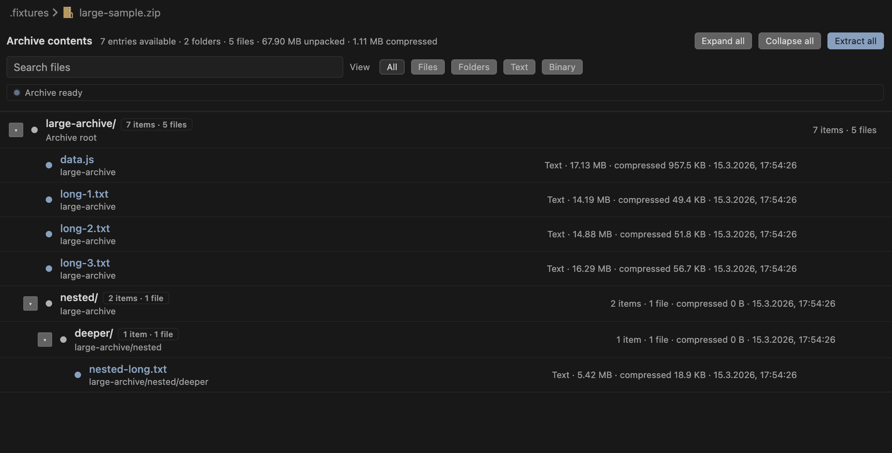

# Compress Preview

Preview the contents of ZIP-, TAR-, and GZIP-based archive files directly inside VS Code.

Compress Preview replaces the usual binary file experience with a focused archive view so you can inspect entries, open text files, and extract files without leaving the editor.

## What It Does

- Opens supported archives in a custom preview view.
- Lists files and folders inside the archive.
- Lets you open text-based files directly in VS Code.
- Opens common binary entries through temporary extracted preview files.
- Lets you extract one file or the full archive.
- Handles large archives with loading and partial-result states instead of hanging forever.

## Screenshots

## How To Use

1. Open a supported archive file in VS Code.
2. Browse the archive contents in the preview.
3. Open a file from the tree to preview it in VS Code.
4. Use **Extract** or **Extract all** when you want files written to disk.

## Supported Archive Formats

`.zip`, `.jar`, `.apk`, `.vsix`, `.xpi`, `.whl`, `.war`, `.ear`, `.tar`, `.tgz`, `.tar.gz`, `.gz`

## What Opens In The Editor

Text-like files open directly in VS Code as read-only virtual documents, including common formats such as:\
`.txt`, `.json`, `.md`, `.xml`, `.html`, `.css`, `.js`, `.ts`, `.yml`, `.yaml`, `.csv`, `.log`

Common binary files open through a temporary extracted preview file so they can use VS Code's normal file handling. GZIP archives expose a single decompressed file entry in the preview.

## Settings

Open **Settings** and search for **Compress Preview**, or edit `settings.json`:

| Setting | Default | Description |
| --- | --- | --- |
| `compress-preview.listTimeoutMs` | `10000` | Max time (ms) to spend listing entries before showing partial results. |
| `compress-preview.watchArchiveFile` | `true` | Reload the preview when the archive file changes on disk. |
| `compress-preview.tempPreviewMaxAgeDays` | `7` | Days to keep cached binary previews under the OS temp folder before pruning. |
| `compress-preview.textExtensions` | `[]` | Additional extensions to treat as text (for example `toml`, `lock`) so entries open in the text preview provider. |

## Notes

- The preview is read-only.
- Binary previews are extracted to a temporary OS-specific cache path under `compress-preview/` before opening.
- Cached binary previews reuse the same archive-entry path and are pruned after the configured number of days without use.
- Very large archives may show a partial list first, with a retry option.
- Folder entries are shown in the archive view but cannot be opened as files.

## Testing

- `npm test` runs unit and fixture-backed integration tests.
- `npm run test:e2e` runs VS Code extension-host smoke tests plus `jsdom`-based webview integration tests against the packaged extension bundle.

## Install

Install from the VS Code Marketplace, or install a generated `.vsix` package manually.

## Feedback

Issues and feature requests: <https://github.com/bircni/compress-preview/issues>

## License

MIT
